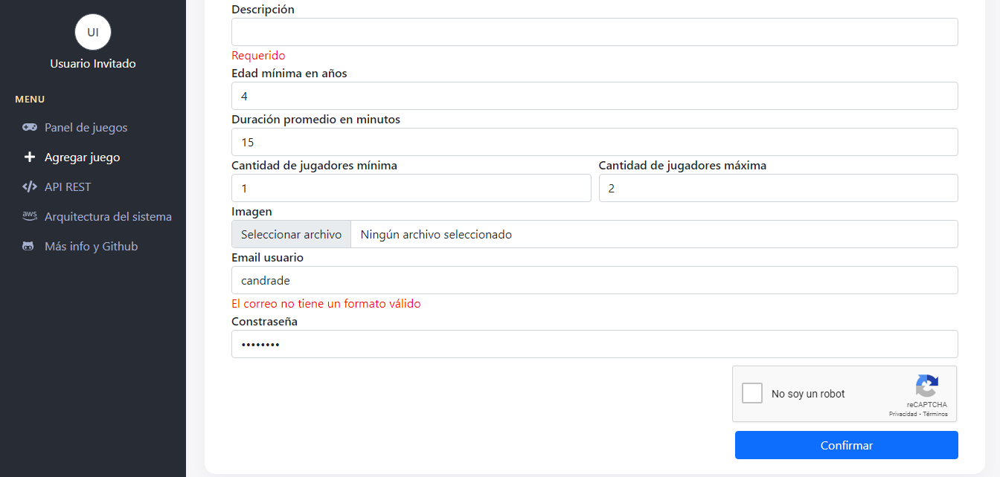

# Panel creado con react más typescript

Este es un proyecto que muestra el desarrollo de un panel de administración.
Es un panel simple el cual permite evidenciar la utilización de React con Typescript.

## Sección para agregar un juego

En esta sección se muestra un formulario con validaciones.

## Sección para consultar a la api de manera visual

## Arquitectura de este mini sistema a nivel de red

El sistema consiste en un frontend (aplicación web) que hace fetch a un backend mediante el protocolo https.
Todo el proyecto utiliza servicios de AWS, tales como instancias de máquinas virtuales y un servidor de almacenamiento Storage S3.

